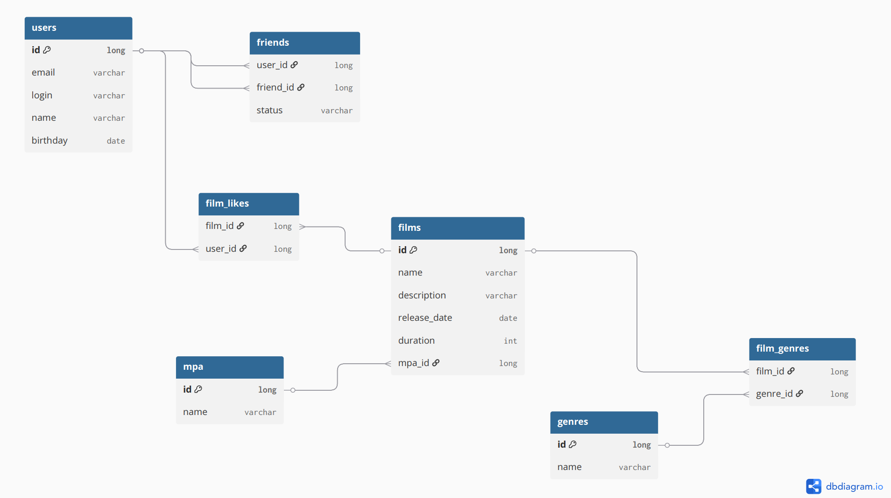

# Описание схемы базы данных

База данных предназначена для хранения информации о пользователях и фильмах, а также их взаимодействиях.

Пользователи могут добавлять друг друга в друзья (таблица friends, со статусом дружбы).

Пользователи могут ставить лайки фильмам (таблица film_likes).

У фильмов может быть несколько жанров (таблица film_genres).

Каждый фильм имеет рейтинг MPA (связь "один ко многим" с таблицей mpa).

Примеры запросов:

1. Получить всех пользователей

    SELECT * 
    FROM users;

2. Получить все фильмы

    SELECT * 
    FROM films;

3. Получить список друзей пользователя

    SELECT u.*
    FROM users AS u
    JOIN friends AS f ON u.id = f.friend_id
    WHERE f.user_id = 1 AND f.status = 'ACCEPTED';